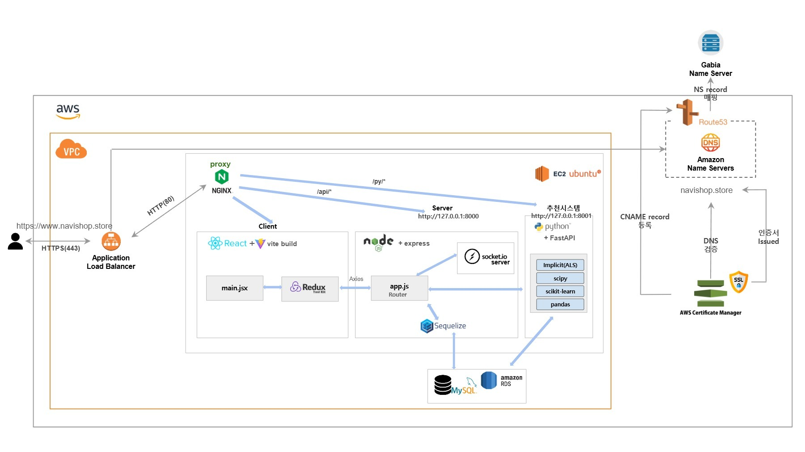

   

## S&R, 나비: 나누고, 비우고

중고상품거래, 중고렌탈 리커머스 사이트

## 개발기간

25.06.25 ~ 25.07.25

## 소개

기존 중고 거래 사이트들의 가장 불편한 점이 뭘까? 바로 <b>채팅 의존적인 네고 시스템</b> 
끝없는 가격 네고 채팅, 애매한 가격 제시와 거래 방법에 인한 시간 낭비, 채팅 부담으로 포기하는 거래들을 떠올리며 기획한 사이트입니다. 

시험 기간에만 필요한 전공책, 여행 때만 쓸 캠핑용품, 한 달만 볼 ott 이런 걸 위해 전액을 지불하는 게 합리적일까? 
나비는 <b>중고 거래 뿐만 아니라 렌탈 서비스도 함께 제공합니다.</b>

---

## 팀원 소개

| 이름   | 역할                                     | GitHub                                   |
| ------ | ---------------------------------------- | ---------------------------------------- |
| 황민영 | 팀장(프론트엔드, 실시간 채팅)            | [링크](https://github.com/wainou06)      |
| 전예은 | 팀원(백엔드, 상품 및 렌탈)               | [링크](https://github.com/yeni0727)      |
| 전준모 | 팀원(백엔드, 로그인/회원가입 및 내 정보) | [링크](https://github.com/aggawa)        |
| 차민준 | 팀원(백엔드, 별점 시스템 및 키워드 관리) | [링크](https://github.com/blessserenity) |

---

## 기술 스택

-  **📊 Machine Learning (Python + FastAPI)**

   -  **FastAPI**: 추천 시스템 API 서버 제공
   -  **pandas**: 데이터 전처리 및 집계
   -  **scikit-learn (LabelEncoder)**: 범주형 데이터 인코딩
   -  **scipy (coo_matrix, csr_matrix)**: 희소 행렬 변환
   -  **implicit (ALS)**: 협업 필터링 기반 추천 알고리즘

---

###  **⭐추천 시스템**

   -  **별점 기반**: 구매자가 직접 판매자의 점수/평점을 남길 수 있습니다. (Explicit Feedback) 별점(1~5점)을 주기 때문에, 선호도를 명시적으로 표현합니다. 모델은 데이터를 그대로 학습하여 별점이 높은 사용자가 올리는 상품을 추천해줍니다.

---

### 시스템 아키텍처
   

### ERD
   

---

